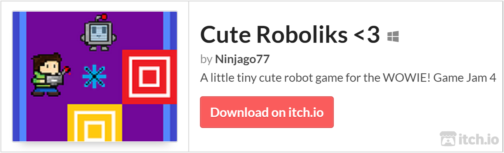

# Cute Roboliks &lt;3
Cute Robolicks &lt;3 is a little tiny cute robot game for the WOWIE! Game Jam 4.

Its very simple to play, easy to control your movements and overall fun to play.

 - WASD for Player movement
 - Arrow keys for Robot movement (if you have a blue line)
 - Right click to shoot sparks
 - "C" to clear sparks
 - "H"/"G" for Hitboxes

Hope you'll like my very first game for my very first Game Jam.
## Playing the Game
>
## Running the Game
1. Download Python 3.8+
>
2. Use the package manager [pip](https://pip.pypa.io/en/stable/) to install [pygame](https://pypi.org/project/pygame/)
>
3. Run [main.py](https://github.com/Ninjago77/cute-roboliks/blob/main/main.py)
>
## Level Editor
